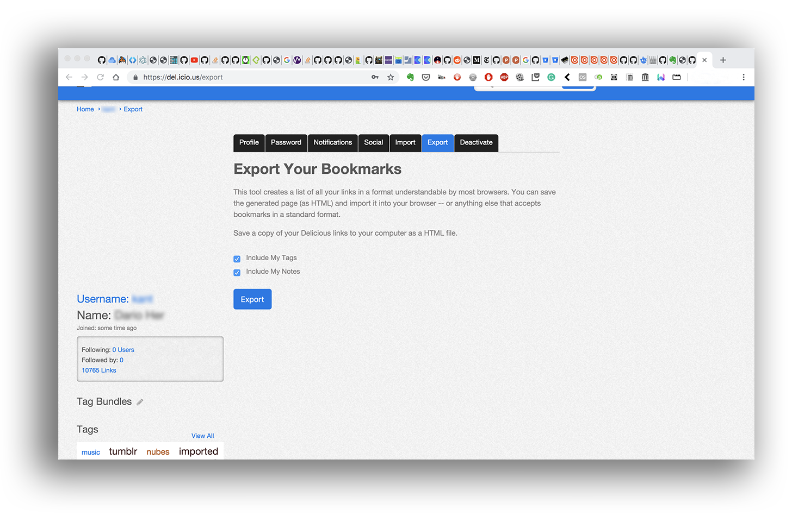

### The easy way to export data
* Log in to your [Del.icio.us](https://del.icio.us/) account (_fingers crossed!_)
* Then go to `Profile` (upper right corner) > `Settings` > `Export` tab. Tick `Include My Tags` and `Include My Notes`. `Export` your bookmarks as `html` format

* The `export.html` can be clean out with:
	- clean up:
		- [Beautiful Soap](https://www.crummy.com/software/BeautifulSoup/)
		- [HTMLCleaner](http://htmlcleaner.sourceforge.net/index.php)
		- [html5lib](https://github.com/html5lib/html5lib-python)
		- [AdvancedHTMLParser](https://github.com/kata198/AdvancedHTMLParser)
	- exporting:
		- to a myriad of format via [Pandoc](https://pandoc.org/)
* Convert your `export.html` to an Evernote XML file. More data can be found [here](https://evernote.com/blog/how-evernotes-xml-export-format-works/) and [there](https://help.evernote.com/hc/en-us/articles/208314308-How-to-import-from-other-note-apps-into-Evernote)

### Another way to export and import data
* Log in to your [Del.icio.us](https://del.icio.us/) account (_fingers crossed!_)
* Then go to `Profile` (upper right corner) > `Settings` > `Export` tab. Tick `Include My Tags` and `Include My Notes`. `Export` your bookmarks as `html` format. Save it.
* Open the `export.html` in your internet browser, ie.: Google Chrome
	- In Chrome (Mac) navigate to `View` and then click on `Developer` and then `View Source`. You also can right click and select `View Page Source`. The keyboard shortcut is `Option` + `Command` + `U`. 
	- In Chrome (PC) press `CTRL` + `U`. Or you can click on the weird-looking key with three horizontal lines in the upper right hand corner. Then click on `Tools` and select `View Source`.
* Select all the code. (ie.: Google Chrome > `Edit` > `Select all`)
* Go to http://jsfiddle.net/kT4nj/ 
* Go to section `Paste html here`. Paste the code.
* Click on `Parse to Evernote XML`. Inside this box, again select all the code parsed (ie.: Google Chrome > `Edit` > `Select all`).
* Open TextEdit (mac) / WordPad (Windows). Create a brand new file. Paste the parsed data. Save as `exported.enex`
* Go to Evernote and [download](https://evernote.com/download) the app according your operating system. Install it. Log in with your account. 
* Once opened go to `File` > `Import notes`. Select the previously exported and saved `exported.enex`
